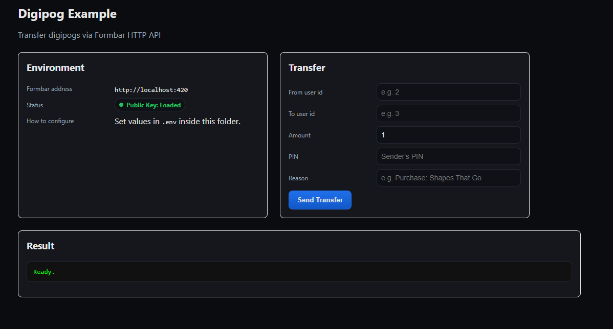

## Formbar Digipog Example
A minimal Express + EJS app to try Digipogs transfers against a Formbar instance via HTTP.



### Prerequisites
- **Node.js**

### Quick start
1. Install dependencies:
```bash
npm install
```
2. Create your env file:
```bash
cp .env-template .env
```
3. Edit `.env` as needed (see Environment below).
4. Start the app:
```bash
node app.js
```
5. Open `http://localhost:422` in your browser (or the `PORT` you set).

### Environment
Set the following in `.env`:
- **FORMBAR_ADDRESS**: Base URL of your Formbar instance (default `http://localhost:420`).
- **PUBLIC_KEY**: Public key content used to verify the JWT returned by Formbar.
  - Example format in `.env`
    ```
    PUBLIC_KEY="-----BEGIN PUBLIC KEY-----\n...\n-----END PUBLIC KEY-----\n"
    ```
- **PORT**: Port to run the app on.

### What it does
- `GET /` renders a simple UI to submit a transfer.
- `POST /transfer` forwards your request to `FORMBAR_ADDRESS/api/digipogs/transfer`, then:
  - returns the raw token
  - verifies it with the `PUBLIC_KEY`
  - includes the decoded payload in the response